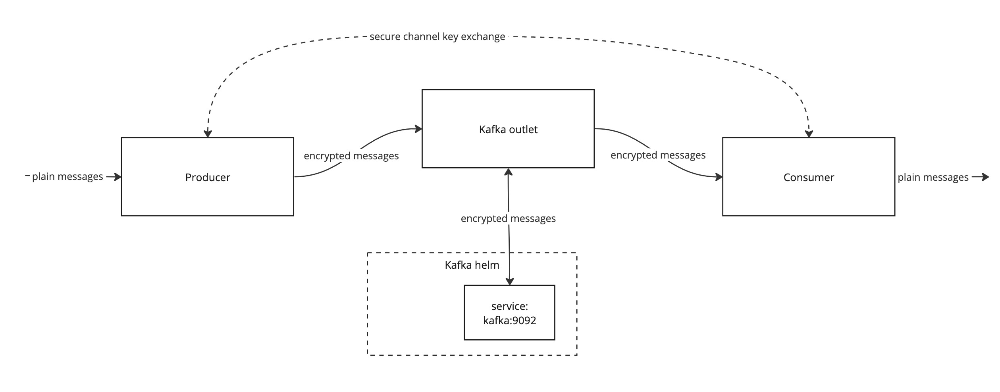

## Kafka demo minikube project

In order to demonstrate provisioning of kafka integration into K8s environment
we set up kafka server, consumer and producer in a minikube cluster.

We configure kafka interceptors for producer and consumer and kafka outlet
to connect to the brokers.




### Requirements

- Docker
- Minikube installed https://minikube.sigs.k8s.io/
- Helm https://helm.sh/
- Ockam to enroll and provision components in a project https://docs.ockam.io/

### Demo sequence

1. Enroll with ockam orchestrator

```
ockam enroll
```

This will create a `default` project which can be used in the demo


2. Get the project information into `mnt/project.json`

**This is needed temporarily to configure kafka-outlet**
**FIXME: remove this step when switching to rust outlet and to credential for the outlet**

```
ockam project information default --output=json > mnt/project.json
```

This project information will be used by provisioned ockam nodes

3. Create enrollment tokens for components to authenticate with the project

**FIXME: add token for the outlet**
```
ockam project enroll --attribute role=member > mnt/consumer.token
ockam project enroll --attribute role=member > mnt/producer.token
```

**QUESTION:** do we have control over expiration of the token?

4. Start the minikube cluster with `mnt` directory mounted

```
minikube start --mount --mount-string="$(pwd)/mnt:/mnt/minikube"
```

`mnt` directory is used to provision project information and enrollment tokens
to the ockam containers

**NOTE:** Further commands in this demo assume that minikube configures `kubectl` and `helm`
are using the minikube cluster.

5. Install kafka helm release

```
helm install kafka oci://registry-1.docker.io/bitnamicharts/kafka
```

We assume default configuration of the helm release resources in the demo configs:
- service `kafka` with port 9092
- three kafka brokers

**NOTE: before next steps you need to build the images if you're using locally built images**

6. Start `kafka-outlet` pod

```
kubectl apply -f kafka-outlet.yaml
```

This pod will connect to the `kafka` service.

7. Start `kafka-consumer` pod

```
kubectl apply -f kafka-consumer.yaml
```

This pod starts `kafka-console-consumer.sh` reading from `demo-topic`

This pod includes ockam kafka sidecar which will intercept and decrypt all encrypted messages.

8. Show logs from kafka consumer which will contain decrypted messages

```
kubectl logs -f kafka-consumer
```

9. Start `kafka-producer` pod

```
kubectl apply -f kafka-producer.yaml
```

This pod starts with kafka docker image, but only runs `sleep infinity`, to start
an actual producer we will use `kubectl exec`.

This pod includes ockam kafka sidecar which will intercept and encrypt messages.

10. Start kafka-console-producer on producer pod to send messages to the topic

```
kubectl exec --tty -i kafka-producer --namespace default -- kafka-console-producer.sh --topic demo-topic --bootstrap-server localhost:9092
```

Important note here: we set `localhost:9092` as a bootstrap server instead of `kafka:9092`,
that will make the producer app connect to the ockam sidecar instead of directly to kafka.

### Building images

Currently pod configurations are using locall images, please make sure you have
loaded them in minikube:

For outlet image:

```
eval $(minikube docker-env)

cd ockam_kafka_outlet
docker build build -t ockam_kafka_outlet:latest .
```

**See the pod configs**


### Implementation details

- Currently using elixir app for `kafka-outlet`, it will validate credentials but will not present its own credentials to the interceptor sidecars.
- We have to use ockam nodes as sidecars because current implementation assumes localhost for dynamic inlets, we could change that with some configuration


## Issues

Node is not presenting credentials when --project-route is not a project. Disabled credential check for now in the outlet app.
There is no API to check that identity is already enrolled, I'm using `node list` to check the node existence.
Since tokens are 1-use only, we need to re-create them when we re-deploy consumer or producer.


## Building images

This setup need outlet image and kafka interceptor image.

They need to be built for minikube as following:

#### For outlet image:
```
cd ./ockam_kafka_outlet
eval $(minikube docker-env)
docker build -t ockam_kafka_outlet:latest .
```

#### For kafka interceptor:

**IMPORTANT You need to have `ockam` binary in your `ockam_sidecar` directory**

First you need to build `ockam` binary for your architecture, currently there is one
pre-built for `aarch64-unknown-linux-gnu`

Then you need to put this binary named `ockam` into `ockam_sidecar` directory.

For minikube running on arm64 mac, you can copy `ockam-aarch64-unknown-linux-gnu`

```
cd ./ockam_sidecar
eval $(minikube docker-env)
docker build -t ockam-kafka-sidecar:latest .
```

